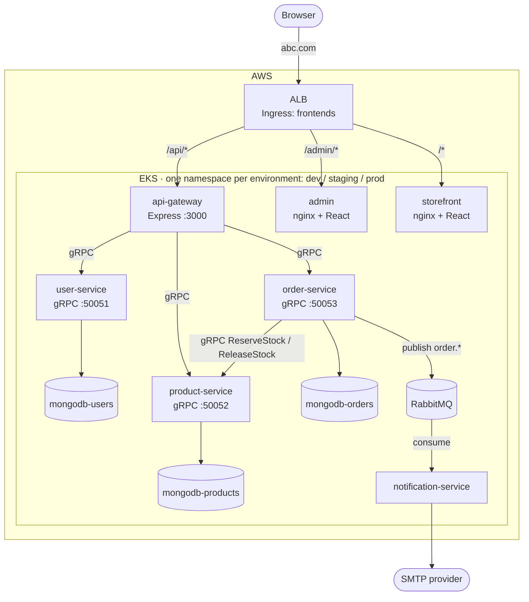
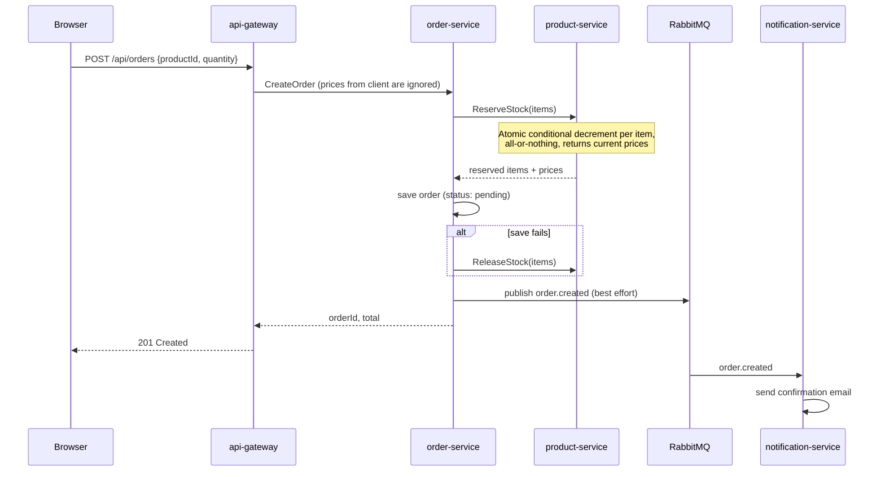

# Architecture

## Overview



Each environment (`dev`, `staging`, `prod`) is a complete copy of this
diagram in its own namespace, with its own ALB, databases and secrets. Services
use short DNS names (`user-service:50051`), so they always reach the instance
in their own namespace.

## Request flow

1. **The browser loads a frontend.** The ALB routes `/admin/*` to the admin
   app and everything else that isn't `/api` to the storefront. Both are
   static React builds served by nginx.
2. **Both frontends call the API with relative URLs** (`/api/...`). The ALB
   sends `/api/*` straight to the api-gateway. Locally (docker-compose), the
   frontends' nginx forwards `/api` instead, because there is no ALB.
3. **The gateway checks the user's token** by calling `user-service.ValidateToken`
   over gRPC. It then checks the role for admin routes and calls the right
   backend service over gRPC.
4. **The backend services** each own their own MongoDB. No service reads
   another service's database.

## Service responsibilities and data ownership

| Service | Owns | Database | Talks to |
|---|---|---|---|
| user-service | Users, password hashes (bcrypt), roles, JWT signing | `users` | — |
| product-service | Products, stock levels | `products` | — |
| order-service | Orders, order status | `orders` | product-service (gRPC), RabbitMQ (publish) |
| notification-service | — (stateless) | — | RabbitMQ (consume), SMTP |
| api-gateway | — (stateless) | — | user, product and order services (gRPC) |

## Placing an order (consistency model)

Stock is reserved **synchronously** before the order is saved, so it can never
be oversold:



Order status moves only along these paths (`UpdateOrderStatus`, admin only):

```
pending ──► confirmed ──► shipped ──► delivered
   │            │
   └────────────┴──► cancelled   (stock is released back to product-service)
```

## Events (RabbitMQ)

| Item | Value |
|---|---|
| Exchange | `order_events` (topic, durable) |
| Routing keys | `order.created`, `order.cancelled`, `order.shipped` |
| Publisher | order-service (confirm channel, persistent messages) |
| Consumer | notification-service, queue `notification_service_queue` (durable) |
| Dead-letter queue | `notification_service_queue.dlq`: messages that failed 3 times, or were invalid JSON |

Events are used **only for notifications**. Stock and order state are kept
consistent through synchronous gRPC calls, so a RabbitMQ outage delays emails
but never corrupts data.

Known limitation: publishing happens after the database write, without a
transactional outbox. If RabbitMQ is unreachable at that moment, the event is
logged and dropped, and that customer gets no email.

## Authentication

- `POST /api/users/login` returns a JWT signed with `JWT_SECRET` (HS256,
  valid for `JWT_EXPIRES_IN`, default 7 days). It contains `userId`, `email`
  and `role`.
- The gateway validates every protected request through user-service. Only
  user-service holds `JWT_SECRET`.
- Roles are `user` (default at signup) and `admin` (set with the
  `promoteAdmin.js` script). Admin-only: product create, update and delete,
  `/api/admin/*`.
- A role change takes effect at the user's next login, because the old token
  still carries the old role.

## Health model

| Kind | Meaning | Used by |
|---|---|---|
| Liveness | Process is running and responsive | Restarts (K8s liveness, startup probes) |
| Readiness | Process **and its hard dependencies** (its MongoDB) are up | Load balancing (K8s readiness, ALB, compose `depends_on`) |

The gRPC services use the standard `grpc.health.v1` protocol. The service name
`""` reports readiness and `"liveness"` reports liveness. For per-service
endpoints, see [SERVICES.md](SERVICES.md).

Downstream outages are **not** allowed to cascade into readiness. For example,
api-gateway readiness doesn't depend on order-service, so an order-service
outage only affects `/api/orders`.
